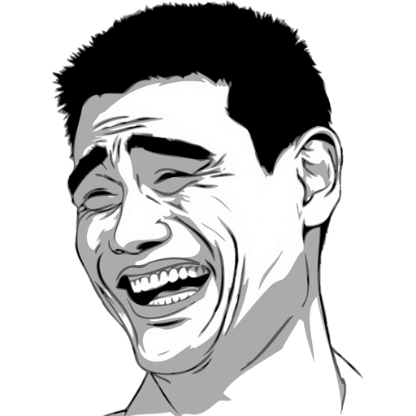

# Heading 1

## Heading 2

### Heading 3

---

## Wrapped Text

This is a paragraph with wrapped text. It should wrap automatically to fit the available width without any special handling required from the caller.

---

## Emphasis

This is *italic using asterisks* and this is _italic using underscores_.

This is **bold using asterisks** and this is __bold using underscores__.

---

## Inline Code

Use `Stream.Open()` to open a file. The `renderer:MarkdownRender(stream)` method renders markdown.

---

## Links

Visit [Lua-Kitsune on GitHub](https://github.com/TerrahKitsune/Lua-Kitsune) for the source code.

---

## Images



---

## Horizontal Rules

Three dashes:

---

Three asterisks:

***

Three underscores:

___

---

## Unordered Lists

  * Item one
  * Item two
  * Item three
    * Nested item A
    * Nested item B
      * Double nested

---

## Ordered Lists

1. First item
2. Second item
3. Third item
   1. Nested ordered A
   2. Nested ordered B

---

## Blockquotes

> This is a blockquote. It should be indented and dimmed.

> Blockquotes can contain *italic* and **bold** text too.

---

## Fenced Code Block

```
local s = Stream.Open('docs/markdown-test.md', 'rb')
renderer:MarkdownRender(s)
```

---

## Tables

| Feature | Status | Notes |
|---|---|---|
| Headings | Done | H1 H2 H3 |
| Bold | Done | ** and __ |
| Italic | Done | * and _ |
| Inline code | Done | backtick |
| Links | Done | hover and click |
| Tables | Done | pipe syntax |

---

## Mixed Inline Styles

A paragraph with **bold**, *italic*, `inline code`, and a [link](https://example.com) all on the same line.

A list with mixed styles:

  * Plain item
  * **Bold item**
  * *Italic item*
  * `Code item`
  * [Link item](https://github.com/TerrahKitsune/Lua-Kitsune)
